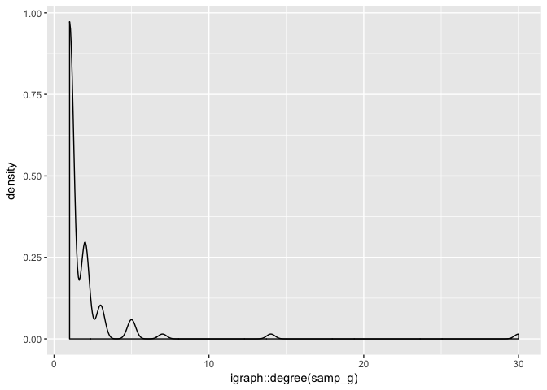
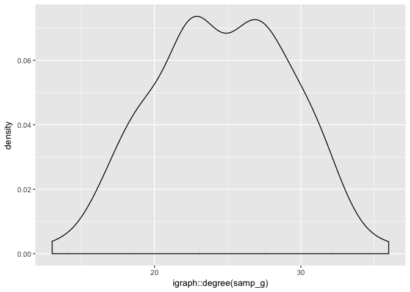

Northwestern R Users Group: Network Analysis in R
================
Richard Paquin Morel
April 5, 2018

### What is network analysis?

  - Relational analysis
  - The unit of analysis is, at minimum, a *dyad*, some relationship
    among some entities
  - Relevant to a variety of fields – social sciences, engineering,
    computer science, biological and physical sciences, mathematics,
    etc.

### Special challenges for network analysis

  - Data format and storage is complex
  - Computationally expensive
  - Standard assumptions of statistical analysis often do not hold
      - Problems of, e.g., autocorrelation

#### Data format and storage is complex

  - Object representing relationships among entities (e.g., advice
    seeking among colleagues in a school)
  - Object representing attributes of entities (e.g,. characteristics of
    those colleagues)

#### Example

``` r
library(tidyverse)
library(ggraph)
data(faux.desert.high, package = "ergm")
ggraph(faux.desert.high) +
  geom_node_point(aes(color = as.factor(grade)), alpha = 1) +
  geom_edge_link(alpha = 0.2) +
  guides(color = guide_legend("Grade")) +
  theme_void()
```

<!-- -->

#### Computationally expensive

A directed network with…

  - 3 nodes \(\rightarrow\) \(2^{3(3-1)} = 64\) possible networks
  - 10 nodes \(\rightarrow\) \(2^{10(10-1)} = 1.2379 * 10^{27}\)
    possible networks
  - 25 nodes \(\rightarrow\) \(2^{600} >\) the estimated number of atoms
    in the universe

#### Violation of standard statistical assumptions

  - Observations in networks are inherently interdependent
  - Probability of ties is not unconditional
  - The formation of a tie in a network impacts the probability of the
    formation of ties throughout the entire
network

### Housekeeping

#### Some vocabulary

| Thing                             | Graph Theory Term | Social Network Term |
| --------------------------------- | ----------------- | ------------------- |
| Entity                            | Vertex            | Node, actor         |
| Relationship                      | Edge              | Tie                 |
| Set of entities and relationships | Graph             | Network             |
| Nature of relationship            | Graph/digraph     | Undirected/directed |

  - If the relationship has some inherent directionality (e.g., “goes to
    for advice”), it is called a *directed* network, or digraph. If not
    it is an *undirected* network, or graph

#### What I will talk about

  - The nitty gritty of network analysis in R
      - The high points and low points of the two big network packages -
        igraph and the statnet suite of packages
      - Creating data
      - Manipulating data
      - Key functions from these packages
      - Visualization

### Network analysis in R: igraph vs. statnet

#### `igraph`

  - Data handling/manipulation/visualization
  - Comprehensive set of functions for graph theory and network analysis
  - Python and C editions
  - Extensive support on Stack Overflow

#### `statnet`

  - A suite of packages
      - Data handling/manipulation/visualization –\> `network`
      - Standard tools for network analysis –\> `sna`
      - Tools for statistical inference –\> `ergm` (and extensions),
        `latentnet`
      - Etc. –\> `EpiModel` for epidemic modeling

#### Which to use?

  - Probably both
      - `statnet` –\> social networks and statistical models of networks
      - `igraph` –\> graph theory and mathematical models of graphs
  - `statnet` created and maintained by statisticians and sociologists
  - `igraph` created and maintained by computer scientists

### How are networks represented?

  - Several formats – adjacency matrix, edgelist, incidence matrix

#### The adjacency matrix

  - An *n* by *n* matrix where rows/columns represent entities and each
    *i, j* cell represents the present or absence of a relationship
    between *i* and *j*.

<!-- end list -->

``` r
### load packages I will use statnet for now.

library(tidyverse)
library(statnet)

data("faux.desert.high") # a fake dataset of friendships in a high school simulated from real data
net <- faux.desert.high # giving it an easier name
```

``` r
as.matrix(net)[7:20, 7:20]
```

    ##    7 8 9 10 11 12 13 14 15 16 17 18 19 20
    ## 7  0 0 0  0  0  0  0  0  1  0  0  0  1  0
    ## 8  0 0 0  0  1  0  0  0  0  0  0  0  0  0
    ## 9  0 0 0  0  0  0  0  0  0  0  0  0  0  0
    ## 10 0 0 0  0  0  0  0  0  0  0  0  0  0  0
    ## 11 0 0 0  0  0  0  0  0  0  0  0  0  0  0
    ## 12 1 0 0  0  0  0  0  0  0  0  0  0  0  0
    ## 13 0 0 1  0  0  0  0  0  0  0  1  0  0  0
    ## 14 0 0 0  0  0  0  0  0  0  0  0  0  0  0
    ## 15 1 0 0  0  0  0  0  0  0  0  0  0  0  0
    ## 16 0 0 0  0  0  0  0  0  0  0  0  0  0  0
    ## 17 0 0 0  0  0  0  0  0  0  0  0  0  0  0
    ## 18 0 0 0  0  0  0  0  0  0  0  0  0  0  0
    ## 19 0 0 0  0  0  0  0  0  0  0  0  0  0  0
    ## 20 0 0 0  0  0  0  0  0  0  0  0  0  0  0

#### The edgelist

  - A two-column data frame with a “To” and “From” column where each row
    represent a relationship between two entities.

<!-- end list -->

``` r
as.edgelist(net)[1:10, ]
```

    ##       [,1] [,2]
    ##  [1,]    1   58
    ##  [2,]    1   74
    ##  [3,]    1   81
    ##  [4,]    1  105
    ##  [5,]    3   30
    ##  [6,]    3   32
    ##  [7,]    3   87
    ##  [8,]    3  101
    ##  [9,]    4   13
    ## [10,]    4   75

### Creating and manipulating network data

#### Prepping data…

``` r
data(faux.desert.high)
adj_matrix <- as.matrix(faux.desert.high)
el <- as.edgelist(faux.desert.high) %>% 
  as.data.frame()
colnames(el) <- c("to", "from")
dhs_attr <- data_frame(id = paste("DHS", net %v% "vertex.names", sep = "_"),
                        grade = net %v% "grade",
                        race = net %v% "race",
                        sex = net %v% "sex")
colnames(adj_matrix) <- dhs_attr$id
rownames(adj_matrix) <- dhs_attr$id
el <- 
  el %>% 
  transmute(to = dhs_attr$id[match(el$to, rownames(dhs_attr))],
            from = dhs_attr$id[match(el$from, rownames(dhs_attr))])
```

  - Three objects:
      - `adj_matrix` - an adjacency matrix representing friendships
        among students at Desert High
      - `el` - an edgelist with the same information
      - `dhs_attr` - a data frame of student attributes

<!-- end list -->

``` r
glimpse(dhs_attr)
```

    ## Observations: 107
    ## Variables: 4
    ## $ id    <chr> "DHS_1", "DHS_2", "DHS_3", "DHS_4", "DHS_5", "DHS_6", "D...
    ## $ grade <int> 10, 12, 8, 12, 12, 12, 7, 11, 10, 12, 9, 7, 10, 9, 7, 10...
    ## $ race  <chr> "W", "W", "O", "W", "H", "W", "W", "W", "W", "W", "W", "...
    ## $ sex   <int> 1, 2, 1, 2, 2, 2, 1, 2, 1, 2, 2, 1, 1, 1, 2, 2, 2, 2, 1,...

#### `statnet` approach

  - Create a network object: `network` or `as.network`

<!-- end list -->

``` r
### network(x, 
###         vertex.attr=NULL, 
###         vertex.attrnames=NULL, 
###         directed=TRUE, 
###         hyper=FALSE, loops=FALSE, multiple=FALSE, bipartite = FALSE, ...)
```

  - `x` can be either an adjacency matrix or an edgelist

#### `statnet` approach

``` r
library(statnet)

net <- network(adj_matrix)
net
```

    ##  Network attributes:
    ##   vertices = 107 
    ##   directed = TRUE 
    ##   hyper = FALSE 
    ##   loops = FALSE 
    ##   multiple = FALSE 
    ##   bipartite = FALSE 
    ##   total edges= 439 
    ##     missing edges= 0 
    ##     non-missing edges= 439 
    ## 
    ##  Vertex attribute names: 
    ##     vertex.names 
    ## 
    ## No edge attributes

#### `statnet` approach

``` r
network(adj_matrix, 
        vertex.attr = list(dhs_attr$grade,
                           dhs_attr$race,
                           dhs_attr$sex),
        vertex.attrnames = list("grade", 
                                "race",
                                "sex"))
```

    ##  Network attributes:
    ##   vertices = 107 
    ##   directed = TRUE 
    ##   hyper = FALSE 
    ##   loops = FALSE 
    ##   multiple = FALSE 
    ##   bipartite = FALSE 
    ##   total edges= 439 
    ##     missing edges= 0 
    ##     non-missing edges= 439 
    ## 
    ##  Vertex attribute names: 
    ##     grade race sex vertex.names 
    ## 
    ## No edge attributes

#### `igraph` approach

  - `graph_from_*` syntax
  - For adjacency matrices: `graph_from_adjacency_matrix`
  - For edgelists: `graph_from_edgelist` or `graph_from_data_frame`

<!-- end list -->

``` r
library(igraph)

g <- graph_from_adjacency_matrix(adj_matrix)
g
```

    ## IGRAPH 7e5a616 DN-- 107 439 -- 
    ## + attr: name (v/c)
    ## + edges from 7e5a616 (vertex names):
    ##  [1] DHS_1 ->DHS_58  DHS_1 ->DHS_76  DHS_1 ->DHS_84  DHS_1 ->DHS_109
    ##  [5] DHS_3 ->DHS_30  DHS_3 ->DHS_32  DHS_3 ->DHS_90  DHS_3 ->DHS_105
    ##  [9] DHS_4 ->DHS_13  DHS_4 ->DHS_77  DHS_5 ->DHS_110 DHS_6 ->DHS_60 
    ## [13] DHS_7 ->DHS_15  DHS_7 ->DHS_19  DHS_7 ->DHS_39  DHS_7 ->DHS_40 
    ## [17] DHS_7 ->DHS_45  DHS_7 ->DHS_48  DHS_7 ->DHS_50  DHS_7 ->DHS_52 
    ## [21] DHS_7 ->DHS_54  DHS_7 ->DHS_72  DHS_7 ->DHS_107 DHS_8 ->DHS_11 
    ## [25] DHS_8 ->DHS_28  DHS_8 ->DHS_36  DHS_8 ->DHS_60  DHS_10->DHS_1  
    ## [29] DHS_12->DHS_3   DHS_12->DHS_7   DHS_12->DHS_34  DHS_12->DHS_40 
    ## + ... omitted several edges

### A word of caution, re: edgelists

#### Edgelists

  - Edgelists do not have information for entities with no relationships
    (isolates)

<!-- end list -->

``` r
graph_from_data_frame(el)
```

    ## IGRAPH f1b7ac1 DN-- 100 439 -- 
    ## + attr: name (v/c)
    ## + edges from f1b7ac1 (vertex names):
    ##  [1] DHS_1 ->DHS_58  DHS_1 ->DHS_76  DHS_1 ->DHS_84  DHS_1 ->DHS_109
    ##  [5] DHS_3 ->DHS_30  DHS_3 ->DHS_32  DHS_3 ->DHS_90  DHS_3 ->DHS_105
    ##  [9] DHS_4 ->DHS_13  DHS_4 ->DHS_77  DHS_5 ->DHS_110 DHS_6 ->DHS_60 
    ## [13] DHS_7 ->DHS_15  DHS_7 ->DHS_19  DHS_7 ->DHS_39  DHS_7 ->DHS_40 
    ## [17] DHS_7 ->DHS_45  DHS_7 ->DHS_48  DHS_7 ->DHS_50  DHS_7 ->DHS_52 
    ## [21] DHS_7 ->DHS_54  DHS_7 ->DHS_72  DHS_7 ->DHS_107 DHS_8 ->DHS_11 
    ## [25] DHS_8 ->DHS_28  DHS_8 ->DHS_36  DHS_8 ->DHS_60  DHS_10->DHS_1  
    ## [29] DHS_12->DHS_3   DHS_12->DHS_7   DHS_12->DHS_34  DHS_12->DHS_40 
    ## + ... omitted several edges

#### Add the missing nodes

``` r
el_net <- graph_from_data_frame(el)
dhs_attr$id[which(!dhs_attr$id %in% V(el_net)$name)]
```

    ## [1] "DHS_23" "DHS_29" "DHS_35" "DHS_67" "DHS_80" "DHS_81" "DHS_85"

``` r
el_net <- igraph::add_vertices(el_net, 7,
                     name = dhs_attr$id[which(!dhs_attr$id %in% V(el_net)$name)])
```

### Manipulating networks

  - Each package has its own special syntax for interacting with
    networks

#### Accessing and manipulating attributes

| package   | class     | vertices | edges | networks |
| --------- | --------- | -------- | ----- | -------- |
| `statnet` | “network” | `%v%`    | `%e%` | `%n%`    |
| `igraph`  | “igraph”  | `V()`    | `E()` | `$`      |

#### In `statnet`

``` r
net <- network(adj_matrix)
network::list.vertex.attributes(net)
```

    ## [1] "na"           "vertex.names"

``` r
net %v% "race" <- dhs_attr$race
net %v% "grade" <- dhs_attr$grade
net %v% "grade"
```

    ##   [1] 10 12  8 12 12 12  7 11 10 12  9  7 10  9  7 10 12 11  7 12  9 11 12
    ##  [24]  7 10  8 10 11 12  8 12  8  9  7 10 12  8 10  7  7  8  7  8  9  7 11
    ##  [47] 12  7 11  7  9  7  9  7 12 11 10 10  8 12 10 12  9 10 10 10  8  7 10
    ##  [70]  9  8  9 11 10 12  8 12 11  9  7  9 12  7  9 10  7 11  9  7 10  7 10
    ##  [93] 11 11 11  8  7  9  7 10  8  8  8 11 10 12  9

#### In `igraph`…

``` r
vertex_attr_names(g)
```

    ## [1] "name"

``` r
V(g)$race <- dhs_attr$race
V(g)$grade <- dhs_attr$grade
V(g)$grade
```

    ##   [1] 10 12  8 12 12 12  7 11 10 12  9  7 10  9  7 10 12 11  7 12  9 11 12
    ##  [24]  7 10  8 10 11 12  8 12  8  9  7 10 12  8 10  7  7  8  7  8  9  7 11
    ##  [47] 12  7 11  7  9  7  9  7 12 11 10 10  8 12 10 12  9 10 10 10  8  7 10
    ##  [70]  9  8  9 11 10 12  8 12 11  9  7  9 12  7  9 10  7 11  9  7 10  7 10
    ##  [93] 11 11 11  8  7  9  7 10  8  8  8 11 10 12  9

#### Subsetting networks

  - Various reasons to subset a network
      - Sub-network of friendships among 8th graders
      - Sub-network of friendships for informal subgroups
  - `igraph::induced_subgraph(network, vertices)`
  - `statnet` - `network %s% vertices`

#### Subsetting

``` r
induced_subgraph(g, which(V(g)$grade == 8))
```

    ## IGRAPH 0170023 DN-- 15 58 -- 
    ## + attr: name (v/c), race (v/c), grade (v/n)
    ## + edges from 0170023 (vertex names):
    ##  [1] DHS_3 ->DHS_30  DHS_3 ->DHS_32  DHS_3 ->DHS_105 DHS_26->DHS_30 
    ##  [5] DHS_26->DHS_59  DHS_26->DHS_107 DHS_30->DHS_3   DHS_30->DHS_26 
    ##  [9] DHS_30->DHS_41  DHS_30->DHS_43  DHS_30->DHS_59  DHS_30->DHS_73 
    ## [13] DHS_30->DHS_79  DHS_30->DHS_105 DHS_30->DHS_107 DHS_32->DHS_3  
    ## [17] DHS_32->DHS_30  DHS_32->DHS_69  DHS_32->DHS_99  DHS_37->DHS_3  
    ## [21] DHS_37->DHS_30  DHS_37->DHS_73  DHS_41->DHS_30  DHS_41->DHS_69 
    ## [25] DHS_41->DHS_106 DHS_41->DHS_107 DHS_43->DHS_26  DHS_43->DHS_30 
    ## [29] DHS_43->DHS_41  DHS_43->DHS_69  DHS_43->DHS_79  DHS_59->DHS_26 
    ## + ... omitted several edges

``` r
### net %s% which((net %v% "grade") == 8)
### if `igraph` is loaded:
### network::`%s%`(net, which((net %v% "grade") == 8))
```

### Sampling random networks

#### `igraph` is the real winner here

  - `igraph` has many (\>30) functions for producing random graphs
  - Syntax - `sample_*`
  - Scale free, uniform probability, small world, Erdös-Rényi,
    preferential attachment, etc., etc.

#### A scale-free network

``` r
samp_g <- sample_pa(100)
qplot(igraph::degree(samp_g), geom = "density")
```

<!-- -->

#### An Erdös-Rényi or Bernoulli network

``` r
samp_g <- sample_gnp(100, 0.25)
qplot(igraph::degree(samp_g), geom = "density")
```

<!-- -->

#### `statnet` has options…

  - Just not as many or as robust
  - `rgraph` –\> Bernoulli
  - `rgnm` –\> conditioned on density
  - `rguman` –\> conditioned on dyad census

### Key network measures

#### Both packages have all standard network measures

  - Node-level indices - Properties of vertices
      - Centrality
  - Graph-level indices - Properties of networks
      - Density, centralization, dyad and triad censuses
  - Subgraph and community detection
      - Blockmodels, cliques, components, communities

#### Node-level indicies

  - Centrality captures the prominence, relative importance, influence
    of a vertex
  - Most basic is degree centrality – how many edges does a vertex have?
    How active is a person? How popular?
      - Is the network directed or undirected?

<!-- end list -->

``` r
### sna::degree(net, cmode = "freeman")
igraph::degree(g, mode = "total")
```

    ##   DHS_1   DHS_2   DHS_3   DHS_4   DHS_5   DHS_6   DHS_7   DHS_8   DHS_9 
    ##       7       3      10       3       1       2      18       5       2 
    ##  DHS_10  DHS_11  DHS_12  DHS_13  DHS_14  DHS_15  DHS_16  DHS_17  DHS_18 
    ##       3       3      17      17       7      12       1       2       1 
    ##  DHS_19  DHS_20  DHS_21  DHS_22  DHS_23  DHS_24  DHS_25  DHS_26  DHS_27 
    ##      11       2      15       4       0       9       8       8       2 
    ##  DHS_28  DHS_29  DHS_30  DHS_31  DHS_32  DHS_33  DHS_34  DHS_35  DHS_36 
    ##       3       0      19       4       8      16      17       0       1 
    ##  DHS_37  DHS_38  DHS_39  DHS_40  DHS_41  DHS_42  DHS_43  DHS_44  DHS_45 
    ##      10      14      15      15      15      16      11       6      13 
    ##  DHS_46  DHS_47  DHS_48  DHS_49  DHS_50  DHS_51  DHS_52  DHS_53  DHS_54 
    ##       6       2      15       6      19       6      20       6      15 
    ##  DHS_55  DHS_56  DHS_57  DHS_58  DHS_59  DHS_60  DHS_61  DHS_62  DHS_63 
    ##       2       4       5       7      10       7      12       1       7 
    ##  DHS_65  DHS_66  DHS_67  DHS_69  DHS_70  DHS_71  DHS_72  DHS_73  DHS_74 
    ##       6      10       0      16      12       4      15       6      21 
    ##  DHS_75  DHS_76  DHS_77  DHS_79  DHS_80  DHS_81  DHS_82  DHS_83  DHS_84 
    ##       4       2       3       9       0       0      12      10      17 
    ##  DHS_85  DHS_86  DHS_87  DHS_88  DHS_89  DHS_90  DHS_91  DHS_92  DHS_93 
    ##       0      13       7       7      11       9      12      11       7 
    ##  DHS_94  DHS_95  DHS_96  DHS_97  DHS_98  DHS_99 DHS_101 DHS_102 DHS_103 
    ##      15       6       1       4       9       8      10      15      12 
    ## DHS_104 DHS_105 DHS_106 DHS_107 DHS_108 DHS_109 DHS_110 DHS_111 
    ##       8       7      10       9      11      13       1       9

#### Node level indices, continued

  - Betweenness centrality is a bit more nuanced: How often does a
    vertex lies on the shortest path between any two given vertices?
      - I.e., you have to pass through *k* to get from *i* to *j*
      - A vertex with high betweenness -\> mediating between others,
        ability to control information flow, e.g.
  - Many different flavors of betweenness
      - `igraph` has two: original (vertex betweenness) and edge
        betweenness
      - `statnet` has many more
      - Borgatti, S. P., & Everett, M. G. (2006). A Graph-theoretic
        perspective on centrality. Social Networks, 28(4),
    466–484.

#### Betweenness

``` r
igraph::betweenness(g, directed = T)
```

    ##       DHS_1       DHS_2       DHS_3       DHS_4       DHS_5       DHS_6 
    ##  249.335696    0.000000  384.074817  148.023291    0.000000    0.000000 
    ##       DHS_7       DHS_8       DHS_9      DHS_10      DHS_11      DHS_12 
    ##  314.731617  166.016667    0.000000   95.166667    0.000000  146.671273 
    ##      DHS_13      DHS_14      DHS_15      DHS_16      DHS_17      DHS_18 
    ##  957.742967  136.410598  167.097184    0.000000   92.918651    0.000000 
    ##      DHS_19      DHS_20      DHS_21      DHS_22      DHS_23      DHS_24 
    ##  190.329652   11.400000  293.895825    0.000000    0.000000   41.236277 
    ##      DHS_25      DHS_26      DHS_27      DHS_28      DHS_29      DHS_30 
    ##   97.010031   86.604577    0.000000   89.000000    0.000000  457.110980 
    ##      DHS_31      DHS_32      DHS_33      DHS_34      DHS_35      DHS_36 
    ##  274.599231   88.824717  381.846622  311.216231    0.000000    0.000000 
    ##      DHS_37      DHS_38      DHS_39      DHS_40      DHS_41      DHS_42 
    ##  318.782921  504.968802  468.981928   88.892165  493.371228  244.006178 
    ##      DHS_43      DHS_44      DHS_45      DHS_46      DHS_47      DHS_48 
    ##   65.657029   94.809091  212.825043   35.315115    0.000000   73.035763 
    ##      DHS_49      DHS_50      DHS_51      DHS_52      DHS_53      DHS_54 
    ##  296.013226  219.456035   14.819986  652.413310  141.992063  189.981304 
    ##      DHS_55      DHS_56      DHS_57      DHS_58      DHS_59      DHS_60 
    ##   27.380952  107.918651   76.887749  110.324981  208.731266  140.193590 
    ##      DHS_61      DHS_62      DHS_63      DHS_65      DHS_66      DHS_67 
    ##  313.607966    0.000000   71.882928    0.000000  149.917856    0.000000 
    ##      DHS_69      DHS_70      DHS_71      DHS_72      DHS_73      DHS_74 
    ##  288.477600   71.387190    3.877485  460.445745  294.986790 1218.092279 
    ##      DHS_75      DHS_76      DHS_77      DHS_79      DHS_80      DHS_81 
    ##   43.755952    0.000000    0.000000  342.786330    0.000000    0.000000 
    ##      DHS_82      DHS_83      DHS_84      DHS_85      DHS_86      DHS_87 
    ##  280.162179  293.245675  754.262282    0.000000  185.853009   29.303150 
    ##      DHS_88      DHS_89      DHS_90      DHS_91      DHS_92      DHS_93 
    ##  272.643081  219.153890  578.425660  384.832117   16.284951  275.840476 
    ##      DHS_94      DHS_95      DHS_96      DHS_97      DHS_98      DHS_99 
    ##  131.231967  125.581412    0.000000   24.895238  218.790964   34.152609 
    ##     DHS_101     DHS_102     DHS_103     DHS_104     DHS_105     DHS_106 
    ##  142.444118  490.088341  182.586254  396.706494    0.000000   93.977056 
    ##     DHS_107     DHS_108     DHS_109     DHS_110     DHS_111 
    ##   49.013765  370.270045  432.388933    0.000000  285.626267

``` r
### sna::betweenness(net, cmode = "directed")
```

#### Others, not discussed

  - Many other nuanced measures of centrality
      - Eigenvector, closeness, Bonacich
      - Both packages have these measures

### Graph-level Indices

#### Properties of networks as a whole

  - *Density* - Total edges in a network : total possible number of
    edges

\[ Possible \ edges \ =n * (n-1) \ or \ \frac{1}{2} n * (n - 1) \]

  - *Centralization* - How much “inequality” is there in centrality
    scores in a network?
      - Measured relative to a theoretical maximum for inequality

<!-- end list -->

``` r
make_star(10) %>% 
  ggraph() +
  geom_node_point() +
  geom_edge_link(alpha = 0.2) +
  theme_void()
```

<!-- -->

#### `igraph` and `statnet` play a bit better here…

``` r
### igraph
edge_density(g)
```

    ## [1] 0.0387057

``` r
### statnet 
gden(net)
```

    ## [1] 0.0387057

#### For centralization…

  - `igraph` has individual functions with a prefix `centr_*`
  - `statnet` has one function with many options

<!-- end list -->

``` r
### igraph
centr_degree(g)
```

    ## $res
    ##   [1]  7  3 10  3  1  2 18  5  2  3  3 17 17  7 12  1  2  1 11  2 15  4  0
    ##  [24]  9  8  8  2  3  0 19  4  8 16 17  0  1 10 14 15 15 15 16 11  6 13  6
    ##  [47]  2 15  6 19  6 20  6 15  2  4  5  7 10  7 12  1  7  6 10  0 16 12  4
    ##  [70] 15  6 21  4  2  3  9  0  0 12 10 17  0 13  7  7 11  9 12 11  7 15  6
    ##  [93]  1  4  9  8 10 15 12  8  7 10  9 11 13  1  9
    ## 
    ## $centralization
    ## [1] 0.06092026
    ## 
    ## $theoretical_max
    ## [1] 22472

``` r
### statnet
### centralization(net, degree)
```

#### Subgraphs, communities

  - `igraph` is vastly superior here – has everything `statnet` has and
    more
  - Many ways to determine cohesive communities within a network
      - Cliques, cores, plexes
      - Blockmodels, community detection

#### Community detection in `igraph`

  - `cluster_*` prefix
  - Computationally expensive
  - Directedness of network often matters (with directed networks much
    more taxing)

<!-- end list -->

``` r
fg <- cluster_fast_greedy(as.undirected(g))
fg
```

    ## IGRAPH clustering fast greedy, groups: 14, mod: 0.53
    ## + groups:
    ##   $`1`
    ##    [1] "DHS_2"  "DHS_3"  "DHS_6"  "DHS_18" "DHS_20" "DHS_31" "DHS_37"
    ##    [8] "DHS_60" "DHS_62" "DHS_95" "DHS_96"
    ##   
    ##   $`2`
    ##    [1] "DHS_7"   "DHS_12"  "DHS_15"  "DHS_19"  "DHS_24"  "DHS_34" 
    ##    [7] "DHS_39"  "DHS_40"  "DHS_42"  "DHS_45"  "DHS_48"  "DHS_50" 
    ##   [13] "DHS_52"  "DHS_54"  "DHS_70"  "DHS_83"  "DHS_86"  "DHS_89" 
    ##   [19] "DHS_92"  "DHS_94"  "DHS_101" "DHS_103"
    ##   
    ##   + ... omitted several groups/vertices

``` r
V(g)$mem <- fg$membership
```

#### Visualization of communities

``` r
ggraph(g) +
  geom_node_point(aes(color = as.factor(mem))) +
  geom_edge_link(alpha = 0.2) +
  theme_void() +
  guides(color=guide_legend(title="membership"))
```

<!-- -->

### Visualization

#### So many options…

  - Goals of network visualization:
      - Create an easy to interpret and meaningful image of the network
      - Display attributes of vertices, edges
  - Both `igraph` and `statnet` support visualiztions of networks
      - `igraph` (IMO) is produces better visualizations
      - Check out the help file – many, many arguments and options, lots
        to tweak

#### Basics

  - Three basics parameters for visualizing networks…
      - Layout - how are the vertices and edges arranged?
      - Vertices - color, size
      - Edges - color, size, transparency, arrows
  - Invaluable resource: <http://kateto.net/network-visualization>

#### Layouts

  - “Fixed” arrangements like circles, grids, trees
  - Algorithmic layouts - treat networks as physical systems
      - Fruchterman-Reingold is a popular one
      - Very fiddly
  - Choose based on what you are trying to communicate with the network
      - If you want “related” vertices to cluster, use an algorithmic
        approach

#### Layouts

  - Hot tip: say the layout you want for multiple visualizations
      - `igraph` prefix: `layout_*`

<!-- end list -->

``` r
l <- layout_with_fr(g)
head(l)
```

    ##            [,1]      [,2]
    ## [1,] -3.9918994 -4.397702
    ## [2,] -3.2761428  4.392553
    ## [3,]  0.2094077 -2.803142
    ## [4,] -0.2490742  1.864972
    ## [5,]  8.9410000 -1.690966
    ## [6,] -4.4691592  3.991211

#### Multiple plots, same layout

``` r
par(mfrow=c(1,3), mar=c(1, 1, 1, 1))
plot(g, layout = l, 
     vertex.color = V(g)$grade, vertex.label = NA, vertex.size = 5,
     edge.arrow.size = 0.5, main = "Grade")
plot(g, layout = l, vertex.color = as.factor(V(g)$race), 
     vertex.label = NA, vertex.size = 5,
     edge.arrow.size = 0.5, main = "Race")
plot(g, layout = l, 
     vertex.color = as.factor(V(g)$sex), vertex.label = NA, vertex.size = 5,
     edge.arrow.size = 0.5, main = "Sex")
```

<!-- -->

#### Visualization in `igraph`

  - `plot()` function
  - Key arguments
      - `layout = ...`
      - Everything related to vertices uses the prefix `vertex.`
          - `vertex.size`, `vertex.color`
      - Everything related to edges uses the prefix `edges.`
          - `edge.color`, `edge.width`, `edge.arrow.size`

<!-- end list -->

``` r
par(mfrow=c(1,3), mar=c(1, 1, 1, 1))
plot(g, layout = l, 
     vertex.color = V(g)$grade, vertex.label = NA, vertex.size = 5,
     edge.arrow.size = 0.5, main = "Grade")
plot(g, layout = l, vertex.color = as.factor(V(g)$race), 
     vertex.label = NA, vertex.size = 5,
     edge.arrow.size = 0.5, main = "Race")
plot(g, layout = l, 
     vertex.color = as.factor(V(g)$sex), vertex.label = NA, vertex.size = 5,
     edge.arrow.size = 0.5, main = "Sex")
```

<!-- -->

#### There isn’t full overlap in parameters

``` r
par(mfrow=c(1,2), mar=c(1, 1, 1, 1))
plot(fg, g, layout = l, vertex.color = V(g)$grade, vertex.label = NA, vertex.size = 5, edge.arrow.size = 0.5, edge.color = "gray50", main = "Communities")
plot(net, vertex.col = (net %v% "grade"), edge.col = "gray50", usecurve = T, edge.curve = 0.01, main = "Curved edges")
```

<!-- -->

#### A newcomer…`ggraph`

  - `ggraph` is new visualization package built on the grammar of
    graphics idiom
      - Actually, there are several (`ggnet`, `ggnet2`, `ggnetwork`)
  - Incorporates network visualiation into `ggplot2`
  - `ggraph(graph, layout) + geom_node_* + geom_edge_*`
  - Much easier, if you are familiar with `ggplot2` already

#### Visualization with `ggraph`

``` r
library(ggraph)
ggraph(g, layout = "nicely") +  # works with igraph and statnet objects
  geom_node_point(aes(color = as.factor(grade))) +
  geom_edge_link(alpha = 0.2)
```

<!-- -->

#### The power of `ggplot2`\!

``` r
library(ggraph)
ggraph(g, layout = "nicely") +  # works with igraph and statnet objects
  geom_node_point(aes(color = as.factor(grade))) +
  geom_edge_link(alpha = 0.2) +
  facet_nodes(~grade)
```

<!-- -->

### Resources

  - Basic network analysis
      - Hannenman & Riddle online textbook:
        <http://faculty.ucr.edu/~hanneman/nettext/>
  - Visualization
      - Katya Ognyanova’s guide:
        <http://kateto.net/network-visualization>
      - Thomas Lin Pedersen’s guide to `ggraph`:
        <https://www.data-imaginist.com/2017/ggraph-introduction-layouts/>
  - Statnet users group:
    <http://www.statnet.org/statnet_users_group.shtml>
  - Stack Overflow’s ‘igraph’ tag
