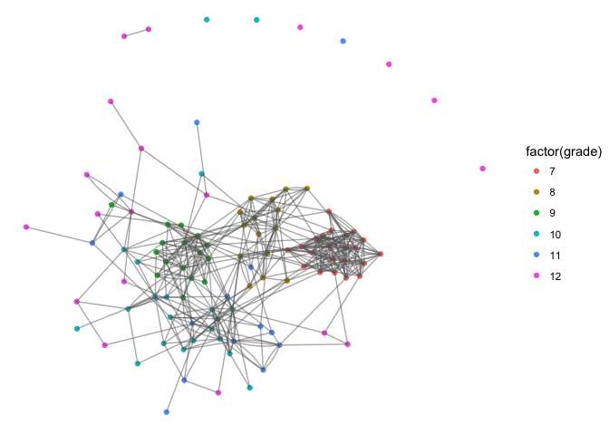

Trial research qualifying paper - sample data
================
Richard Paquin Morel
1/30/2018

## Background and data

My dissertation uses data that I cannot publicly share. So I will use a
publicly available set to demonstrate this code. The `ergm` pack has a
number of sample social networks. First, load the relevant libraries.

``` r
library(statnet)
library(ggplot2)
library(tidyverse)
library(ggraph)
```

I will use the `faux.desert.high` network, which approximates the
structure the network used for my study. It is directed, has 107 nodes
(compared to 84) and a density of 0.04 (compared to 0.07). This is a
simulated high school friendship network, using parameters estimated
from real-life friendship networks in the AddHealth dataset.

``` r
data("faux.desert.high")
summary(faux.desert.high, print.adj = FALSE)
```

    ## Network attributes:
    ##   vertices = 107
    ##   directed = TRUE
    ##   hyper = FALSE
    ##   loops = FALSE
    ##   multiple = FALSE
    ##   bipartite = FALSE
    ##   title = comm6.net
    ##  total edges = 439 
    ##    missing edges = 0 
    ##    non-missing edges = 439 
    ##  density = 0.0387057 
    ## 
    ## Vertex attributes:
    ## 
    ##  grade:
    ##    integer valued attribute
    ##    107 values
    ## 
    ##  race:
    ##    character valued attribute
    ##    attribute summary:
    ##  A  B  H  O  W 
    ##  1  2  3  7 94 
    ## 
    ##  scode:
    ##    integer valued attribute
    ##    107 values
    ## 
    ##  sex:
    ##    integer valued attribute
    ##    107 values
    ##   vertex.names:
    ##    character valued attribute
    ##    107 valid vertex names
    ## 
    ## No edge attributes

Not a particularly large high school, with only 107 students. The
network in my study consisted of 84 professionals involved in providing
learning professional learning opportunities to K-12 teachers.

Let’s take a quick look at the network using the [`ggraph`
package](https://github.com/thomasp85/ggraph). `ggraph` is rapidly
becoming my go-to for network visualization. It’s clean, intuitive, and
based on `ggplot2`.

``` r
ggraph(faux.desert.high) +
  geom_node_point(aes(colour = factor(grade))) +
  geom_edge_fan(colour = "grey40", alpha = 0.5) +
  theme_void()
```

<!-- -->

## Brokerage and model specification

My study explores inter- and intra-organization brokering. Put simply,
brokering occurs when a individual has social connections to two other
people who are not connected themselves. A whole line of research has
theorized and docuements the benefits of occupying brokerage positions.
For my study, I was interested in how influential individuals shared and
gathered information.

The measure of brokerage I use comes from Gould and Fernandez’s seminal
1989 paper in *Sociological Methododology*. I use this method because it
exploits group membership within a network to define brokering. Gould
and Fernandez define five specific brokerage roles based on the group
membership of the broker and the two other people they broker between.
I’m not going to bother defining them here, but basically they come
down to are you brokering between groups or within groups. The
`brokerage` function from the `sna` package yields several measures – I
only want the raw brokerage scores, stored in `raw.nil`. This score is a
count of the number of times a node mediates between two otherwise
unconnected nodes.

For this network, I will use grade as the grouping variable for
measuring brokerage. For my actual study, I used membership in an
organizational
sector.

``` r
brkrg <- brokerage(faux.desert.high, faux.desert.high %v% "grade")$raw.nli
head(brkrg)
```

    ##   w_I w_O b_IO b_OI b_O  t
    ## 1   1   0    1    5   1  8
    ## 2   0   0    0    0   0  0
    ## 3   4   0    3    8   3 18
    ## 4   0   0    0    1   1  2
    ## 5   0   0    0    0   0  0
    ## 6   0   0    0    0   0  0

This returns a matrix with six columns representing the five brokerage
roles and a total column, which is a sum of the five other columns.

I used an exponential random graph model of the network to form a
baseline model. From this baseline model, I will simulate 1,000 networks
that will form the distribution against which I will compared the
observed values The model selection is iterative. Here are the
parameters I use:

  - *nodematch(“grade”)*. Based on homophily theory, I figure that ties
    are more likely to form within than between grades. I will allow for
    the possibility of differential homophily, as older grades may be
    less likely to show grade-level homophily  
  - *mutual*. From balance theory, we know that friendship ties are
    usually reciprocated.  
  - *gwesp*. A measure triadic closure. Friends of friends are often
    friends. The decay is iteratively choosen to improve model fit  
  - *gwdsp*. A measure of triadic openness. This captures brokerage.

The estimation of ergm parameters can take a while. For the actually
study, I crank some of the MCMC tuning parameters to ensure good mixing
and the locating of an adequate sample space. It takes a few hours to
run on my MBA. Here, I use the default settings and it runs in a few
minutes. Still, maybe get a drink or use the restroom.

``` r
model <- ergm(faux.desert.high ~ edges + mutual + 
                    intransitive +
                    gwesp(0.1, T) + 
                    gwdsp(0.1, T) +
                    nodematch("grade"))
        
summary(model)
```

    ## 
    ## ==========================
    ## Summary of model fit
    ## ==========================
    ## 
    ## Formula:   faux.desert.high ~ edges + mutual + intransitive + gwesp(0.1, 
    ##     T) + gwdsp(0.1, T) + nodematch("grade")
    ## 
    ## Iterations:  2 out of 20 
    ## 
    ## Monte Carlo MLE Results:
    ##                 Estimate Std. Error MCMC % p-value    
    ## edges           -4.56994    0.16667      0 < 1e-04 ***
    ## mutual           1.68784    0.19673      0 < 1e-04 ***
    ## intransitive     0.03863    0.01915      0 0.04366 *  
    ## gwesp.fixed.0.1  1.22111    0.10219      0 < 1e-04 ***
    ## gwdsp.fixed.0.1 -0.08810    0.02941      0 0.00274 ** 
    ## nodematch.grade  1.31187    0.11753      0 < 1e-04 ***
    ## ---
    ## Signif. codes:  0 '***' 0.001 '**' 0.01 '*' 0.05 '.' 0.1 ' ' 1
    ## 
    ##      Null Deviance: 15723  on 11342  degrees of freedom
    ##  Residual Deviance:  2624  on 11336  degrees of freedom
    ##  
    ## AIC: 2636    BIC: 2680    (Smaller is better.)

After specifying and estimating the model, it is critical to assess its
fit to the data and to diagnose any issues in the Markov Chain Monte
Carlo simulation.

I will conduct three diagnostics: two goodness-of-fit tests (on for
specified parameters and one for parameters not in the model) and one
MCMC diagnostic.

First, let’s make sure the model parameters does a good job capturing
observed network.

``` r
model_gof <- gof(model)
plot(model_gof)
```

<!-- --><!-- --><!-- --><!-- --><!-- -->

This assessment is insufficient in itself (see Hunter, D. R., Goodreau,
S. M., & Handcock, M. S. (2008). Goodness of Fit of Social Network
Models. Journal of the American Statistical Association, 103(481),
248–258). The model should also do a good job capturing network
statistics *not* included in the model.

To do this, we need to simulate some networks based on the parameters in
the model, derive distributions of network statistics, and compare them
the to observed statistics. We need these simulated networks for the
main analysis anyway. Let’s compared the number of triangles in the
observed and simulated networks.

``` r
model_sim <- simulate(model, 
                      nsim = 1000, 
                      seed = 47, 
                      basis = faux.desert.high)

model_tridist <- map_dbl(model_sim, ~ summary(. ~ triangle))
model_tridist %>% 
  as_data_frame() %>% 
  ggplot() +
  geom_density(aes(x = value)) +
  geom_vline(xintercept = summary(faux.desert.high ~ triangle))
```

<!-- -->

Ok, not too bad. Let’s see where the observed value falls in the
distribution.

``` r
ecdf(model_tridist)(summary(faux.desert.high ~ triangle))
```

    ## [1] 0.38

Now I can proceed with the brokerage test. Here’s the basic process:

1)  Specify an exponential random graph model to form the baseline.
    (Done.)
2)  Evaluate the model fit to the data. (Done.)
3)  Simulate 1000 networks using the estimated parameters. (Done.)
4)  Derive brokerage scores for each node in each simulated network.
5)  Randomly sample 1000 scores per role per grade.
6)  Compare the observed scores for each node to the conditional
    distribution. 95th percentile or higher, I consider a broker.

I condition the distribution on grade-level for a couple reason. First,
we probably expect the dynamics of brokerage are different for freshman
and seniors. Freshman are the lowest on the social hierarchy and so
probably have fewer brokerage opporunities. Second, it is necessary to
condition on the size of the grade, since the measure of brokerage is a
count. Fewer people, fewer opportunities for brokerage. Gould and
Fernandez condition on group size in their paper.

``` r
brkrg_sim <- map(model_sim, ~brokerage(., . %v% "grade")) %>% 
  map(`[[`, "raw.nli") %>%
  map(as_data_frame) %>% 
  map(., ~ mutate(., grade = faux.desert.high %v% "grade")) %>% 
  bind_rows(.)
```

Now for each simulated network, I have a brokerage score in each
brokerage role for each node in the network. That’s six scores for 107
actors in 1000 networks. 642,000 scores. I will randomly sample 1000 per
role per grade. That’s 6 \* 6 \* 1000 = 24,000 scores.

``` r
dist <- brkrg_sim %>% 
  group_by(grade) %>% 
  sample_n(1000) %>%
  split(., .$grade)

obs <- brkrg %>% 
  as_data_frame() %>% 
  mutate(grade = faux.desert.high %v% "grade",
         id = faux.desert.high %v% "vertex.names") %>% 
  split(., .$grade)
```

I have two lists of data frames. One, `dist`, consists of simulated
brokerage scores for each grade. The other, `obs`, consists of the
observed brokerage scores by grade. Let’s look.

``` r
head(dist[[1]])
```

    ## # A tibble: 6 x 7
    ## # Groups:   grade [1]
    ##     w_I   w_O  b_IO  b_OI   b_O     t grade
    ##   <dbl> <dbl> <dbl> <dbl> <dbl> <dbl> <int>
    ## 1 22.0   0     0     4.00  0    26.0      7
    ## 2  7.00  0    14.0   6.00  3.00 30.0      7
    ## 3  2.00  1.00  3.00  2.00  0     8.00     7
    ## 4 34.0   0    14.0   9.00  2.00 59.0      7
    ## 5  2.00  0     0     0     0     2.00     7
    ## 6  9.00  0     0     3.00  0    12.0      7

``` r
head(obs[[1]])
```

    ## # A tibble: 6 x 8
    ##     w_I   w_O  b_IO  b_OI   b_O     t grade id   
    ##   <dbl> <dbl> <dbl> <dbl> <dbl> <dbl> <int> <chr>
    ## 1 44.0      0 14.0   0     0     58.0     7 7    
    ## 2 34.0      0 13.0   0     0     47.0     7 12   
    ## 3 20.0      0  0     6.00  0     26.0     7 15   
    ## 4  9.00     0  3.00  6.00  1.00  19.0     7 19   
    ## 5 11.0      0  0     0     0     11.0     7 24   
    ## 6 29.0      0 16.0   5.00  0     50.0     7 34

Let’s continue to explore by comparing some observed scores to the
simulated distributions.

``` r
set.seed(83)
t <- obs[[1]] %>% select(w_I) %>% sample_n(1) %>% pull()

ggplot(dist[[1]]) +
  geom_density(aes(x = w_I)) +
  geom_vline(xintercept = t, linetype = 2)
```

<!-- -->

``` r
set.seed(35)
t <- obs[[3]] %>% select(b_OI) %>% sample_n(1) %>% pull()

ggplot(dist[[3]]) +
  geom_density(aes(x = b_OI)) +
  geom_vline(xintercept = t, linetype = 2)
```

<!-- -->

To test incidence of brokerage, I need to compare each node’s score for
each brokerage role to the simulated distributions – all of this
conditioning on grade level. The code below is not pretty but gets the
job done.

``` r
w_I <- list()
for (i in 1:length(dist)){
  w_I[[i]] <- map_dbl(1:nrow(obs[[i]]), function(x) mean(dist[[i]]$w_I >= obs[[i]]$w_I[x]))
}
w_O <- list()
for (i in 1:length(dist)){
  w_O[[i]] <- map_dbl(1:nrow(obs[[i]]), function(x) mean(dist[[i]]$w_O >= obs[[i]]$w_O[x]))
}
b_IO <- list()
for (i in 1:length(dist)){
  b_IO[[i]] <- map_dbl(1:nrow(obs[[i]]), function(x) mean(dist[[i]]$b_IO >= obs[[i]]$b_IO[x]))
}
b_OI <- list()
for (i in 1:length(dist)){
  b_OI[[i]] <- map_dbl(1:nrow(obs[[i]]), function(x) mean(dist[[i]]$b_OI >= obs[[i]]$b_OI[x]))
}
b_O <- list()
for (i in 1:length(dist)){
  b_O[[i]] <- map_dbl(1:nrow(obs[[i]]), function(x) mean(dist[[i]]$b_O >= obs[[i]]$b_O[x]))
}
t <- list()
for (i in 1:length(dist)){
  t[[i]] <- map_dbl(1:nrow(obs[[i]]), function(x) mean(dist[[i]]$t >= obs[[i]]$t[x]))
}

b_scores <- data.frame(Name = bind_rows(obs)[,"id"],
                       Coordinator = unlist(w_I),
                       Consultant = unlist(w_O),
                       Representative = unlist(b_IO),
                       Gatekeeper = unlist(b_OI),
                       Liaison = unlist(b_O),
                       Total = unlist(t),
                       stringsAsFactors = F)

head(b_scores)
```

    ##   id Coordinator Consultant Representative Gatekeeper Liaison Total
    ## 1  7       0.099          1          0.139      1.000   1.000 0.155
    ## 2 12       0.206          1          0.151      1.000   1.000 0.257
    ## 3 15       0.418          1          1.000      0.408   1.000 0.524
    ## 4 19       0.701          1          0.549      0.408   0.355 0.651
    ## 5 24       0.636          1          1.000      1.000   1.000 0.820
    ## 6 34       0.279          1          0.096      0.471   1.000 0.224

So those are all percentile ranks for each node’s brokerage score in
each role. We have to choose an alpha as the cutoff for significance. I
used 0.05 in my paper, but I could see an argument for 0.01. I will
create a dummy variable for each row where 1 indicate the node occupies
a brokerage role and 0 otherwise.

``` r
brokers <- b_scores %>% 
  mutate_at(vars(Coordinator:Total), funs(if_else(. <= 0.01, 1, 0))) %>% 
  transmute(id = as.numeric(id), 
            broker = if_else(rowSums(select(., Coordinator:Total)) == 0, 0, 1)) %>% 
  arrange(id)

faux.desert.high %v% "broker" <- brokers$broker
```

Let’s take a look at here those brokers are. I’m going to increase the
size of broker nodes so that they are easy to
spot.

``` r
faux.desert.high %v% "size" <- if_else(faux.desert.high %v% "broker" == 1, 5, 1)

ggraph(faux.desert.high) +
  geom_node_point(aes(colour = factor(grade), size = size)) +
  geom_edge_fan(colour = "grey40", alpha = 0.25) +
  theme_void()
```

<!-- -->

As suspected, most of the brokering activities occur in the middle
grades – the high schoolers who probably have the most incentive to form
friendships across grades. The seventh graders are new and so stick
together; the seniors are pretty much checked out. This make me curious
about how heterogeneous the ego networks of the brokers are. I like the
*network range* algorithm developed by Burt (1982) and used by nicely by
Reagans and McEvily (2002). It is a measure of the divserity of an
actor’s network ties. [I coded the algorithm in R
myself](https://github.com/ramorel/network-range), since none of the
network packages in R have it baked in. It’s a bit of an obscure
measure, so that’s probably why. I give a more detailed explanation in
the
[README](https://github.com/ramorel/network-range/blob/master/README.md)
for the repository. Put succinctly – an ego’s network range increases
under two conditions: (1) the more ties they have to others in different
groups; and (2) the extent to which the individuals in those groups are
loosely connected. An ego network with a lot of range is one where an
actor has connections to many groups that are loosely connected.

I’ll import the function (called `netrange`) from GitHub.

The function has three arguments: network, attr (the grouping variable)
and directed (which defaults to TRUE). `NaN` is returned for isolates.
The scores range from 0 to 1, with 1 indicating the most diversity.

``` r
brokers <- brokers %>% 
  mutate(range = netrange(faux.desert.high, faux.desert.high %v% "grade"))

head(brokers)
```

    ##   id broker     range
    ## 1  1      0 0.6846497
    ## 2  2      0       NaN
    ## 3  3      0 0.5246731
    ## 4  4      0 0.7298701
    ## 5  5      0 0.4000000
    ## 6  6      0 0.4000000

Let’s compare the brokers and non-brokers on range scores.

``` r
brokers %>% 
  group_by(broker) %>% 
  summarize(mean_range = mean(range, na.rm = T),
            sd_range = sd(range, na.rm = T))
```

    ## # A tibble: 2 x 3
    ##   broker mean_range sd_range
    ##    <dbl>      <dbl>    <dbl>
    ## 1   0         0.450    0.231
    ## 2   1.00      0.585    0.210

Indeed the brokers have greater mean range scores.
